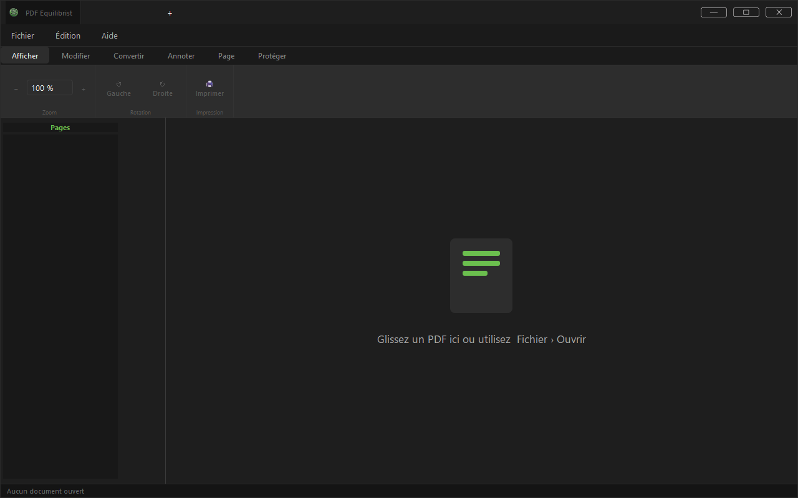
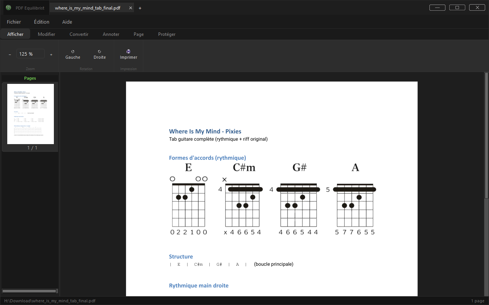
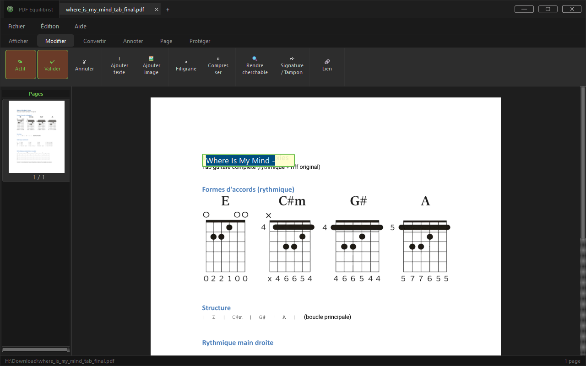
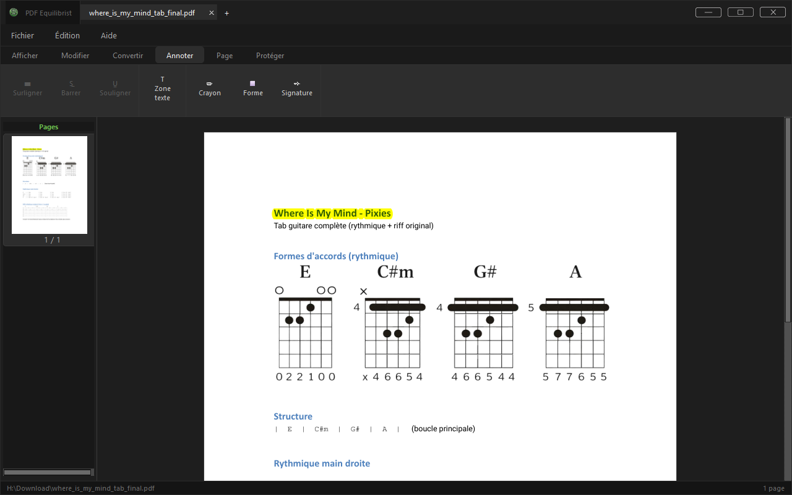
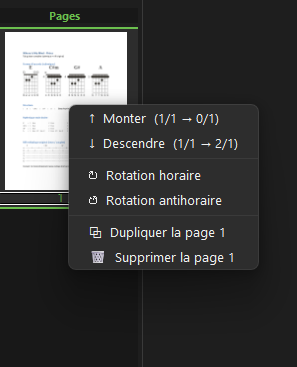
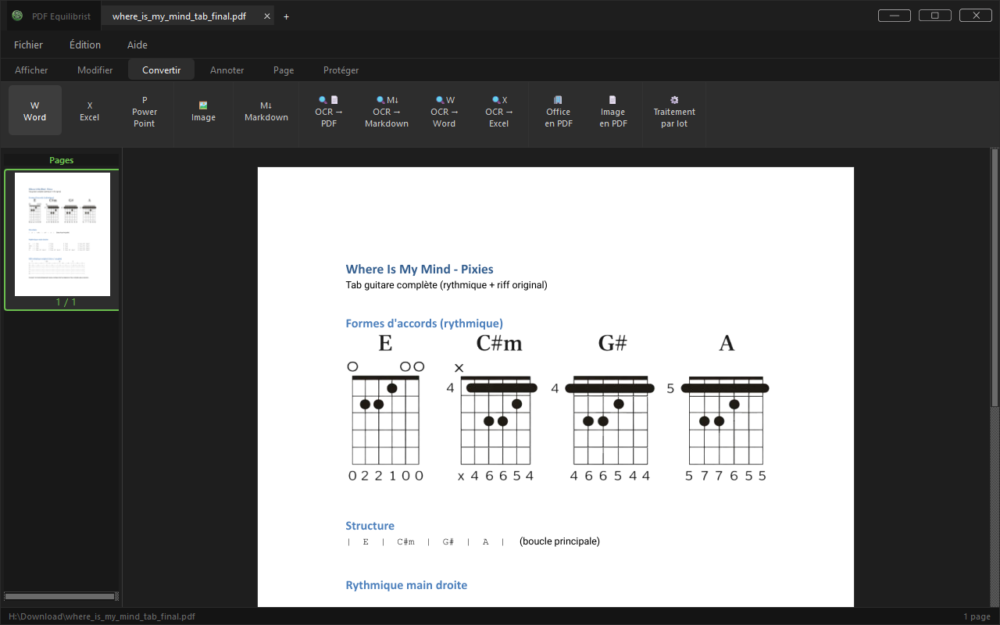
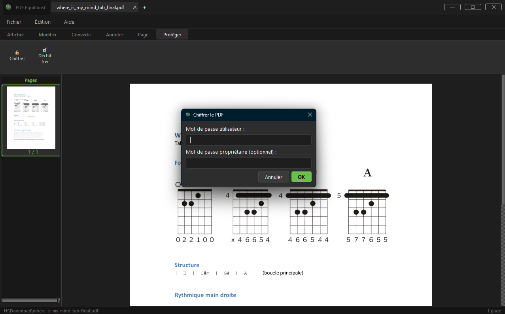
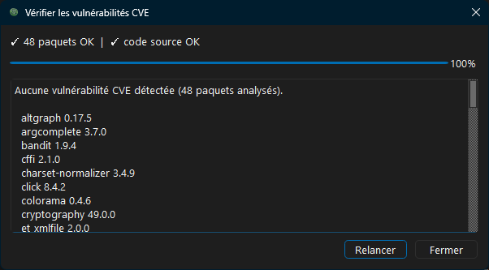

# PDF-Equilibrist

[](https://github.com/Bit-Scripts/PDF-Equilibrist/actions/workflows/ci.yml)
[](https://github.com/Bit-Scripts/PDF-Equilibrist/releases/latest)
[](https://github.com/Bit-Scripts/PDF-Equilibrist/releases)
[](LICENSE.md)
[](.)
[](.)
[](.)

**PDF-Equilibrist** est un éditeur PDF de bureau, gratuit et open-source, construit en Python
avec **PyQt6** et **PyMuPDF**. Il fonctionne entièrement en local — pas de cloud, pas de
télémétrie, pas de compte requis — et permet de lire, modifier, convertir, annoter et
protéger vos documents PDF.



## Fonctionnalités

### Affichage
Zoom, rotation, navigation multi-onglets et multi-pages.



### Édition
Modification de texte, filigrane, signatures et tampons.



### Annotation
Surlignage, barré, soulignement, zones de texte.



### Pages
Insertion, division, fusion, inversion.



### Conversion
Word, Excel, PowerPoint, images, Office → PDF, image → PDF, OCR local, traitement par lot.



### Protection
Chiffrement et déchiffrement AES-256.



## Sécurité & confidentialité

Contrairement aux outils PDF en ligne qui envoient vos fichiers sur des serveurs tiers,
PDF-Equilibrist exécute tous ses traitements à 100 % en local.

L'application embarque aussi son propre outil d'audit de sécurité, accessible en un clic
depuis l'interface :

- **Analyse SAST du code source** via [Bandit](https://github.com/PyCQA/bandit).
- **Vérification des dépendances** contre les vulnérabilités connues via l'API [OSV](https://osv.dev/).



## Installation

1. Créez un environnement Python compatible (`>=3.12`).
2. Installez les dépendances :

```powershell
python -m pip install -r requirements.txt
```

3. Exécutez l’application :

```powershell
python src/pdf_equilibrist/main.py
```

## Construction et packaging

- Le script NSIS d’installation se trouve dans `installer/PDF-Equilibrist.nsi`.
- Les artefacts compilés ne doivent pas être suivis dans le dépôt source.
- Les sorties de build sont ignorées par `.gitignore`.

## Documentation

La documentation source se trouve dans le dossier `docs/`.

## Licence

Ce projet est distribué sous licence GNU GPL v3.0 (ou ultérieure). Voir [LICENSE.md](LICENSE.md).
